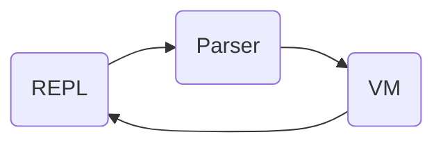

[cell.rs]: https://github.com/strtok/marwood/blob/master/marwood/src/cell.rs
[parse.rs]: https://github.com/strtok/marwood/blob/master/marwood/src/parse.rs
[lex.rs]: https://github.com/strtok/marwood/blob/master/marwood/src/lex.rs
[prelude]: https://github.com/strtok/marwood/blob/master/marwood/prelude.scm

## Marwood Library

At Marwood's core is a library that provides the creation of a scheme virtual machine. The virtual machine represents a global environment, and may be used to evaluate scheme expressions. 

Here's an example demonstrating creation of a recursive factorial procedure, and evaluation of `(factorial n)` for n in 0..10:

```rust,noplayground
use marwood::vm::Vm;
use marwood::{lex, parse};

extern crate marwood;

fn main() {
    let mut vm = Vm::new();
    let code = r#"
        (define (factorial n)
            (let factorial ([n n] [acc 1])
               (if (zero? n)
                   acc
                   (factorial (- n 1) (* acc n)))))
    "#;
    vm.eval(&parse!(code)).unwrap();
    for it in 0..10 {
        println!(
            "the factorial of {} is {}",
            it,
            vm.eval(&parse!(&format!("(factorial {})", it))).unwrap()
        );
    }
}
```

Executing this example produces the following output:

```
the factorial of 0 is 1
the factorial of 1 is 1
the factorial of 2 is 2
the factorial of 3 is 6
the factorial of 4 is 24
the factorial of 5 is 120
the factorial of 6 is 720
the factorial of 7 is 5040
the factorial of 8 is 40320
the factorial of 9 is 362880
```

## Marwood Library Components

