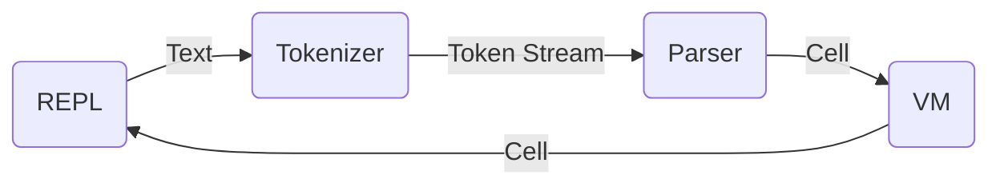

[built-in]: https://github.com/strtok/marwood/tree/master/marwood/src/vm/builtin
[cell]: https://github.com/strtok/marwood/blob/master/marwood/src/cell.rs
[compiler]: https://github.com/strtok/marwood/blob/master/marwood/src/vm/compile.rs
[parser]: https://github.com/strtok/marwood/blob/master/marwood/src/parse.rs
[prelude]: https://github.com/strtok/marwood/blob/master/marwood/prelude.scm
[repl]: https://github.com/strtok/marwood/blob/master/marwood-repl/src/main.rs
[tokenizer]: https://github.com/strtok/marwood/blob/master/marwood/src/lex.rs
[virtual machine]: https://github.com/strtok/marwood/blob/master/marwood/src/vm/mod.rs
[web-repl]: https://github.com/strtok/marwood/tree/master/marwood-wasm

## Marwood Library

At Marwood's core is a library that provides the creation of scheme virtual machines. The virtual machines represent a global environment, and may be used to evaluate scheme expressions.

Here's an example demonstrating creation of a recursive factorial procedure, and evaluation of `(factorial n)` for n in 0..10:

```rust,noplayground
use marwood::vm::Vm;

fn main() {
    let mut vm = Vm::new();
    let code = r#"
        (define (factorial n)
            (let factorial ([n n] [acc 1])
               (if (zero? n)
                   acc
                   (factorial (- n 1) (* acc n)))))
    "#;

    vm.eval_text(&code).unwrap();

    for it in 0..10 {
        let (cell, _) = vm.eval_text(&format!("(factorial {})", it)).unwrap();
        println!("the factorial of {} is {}", it, cell);
    }
}
```

Which produces the following output:

```
the factorial of 0 is 1
the factorial of 1 is 1
the factorial of 2 is 2
the factorial of 3 is 6
the factorial of 4 is 24
the factorial of 5 is 120
the factorial of 6 is 720
the factorial of 7 is 5040
the factorial of 8 is 40320
the factorial of 9 is 362880
```

## Marwood Highlevel Design

The remainder of this text dives into the detail of all of the components that make up Marwood's library:

* A [parser] and [tokenizer] used to create Marwood's AST [cell] object. This object acts as both input to the VM's eval() function, and also the result of an evaluation. The tokenizer is also useful in other situations, such as repl bracket matching and syntax hilighting.
  
* A [virtual machine] that represents a scheme environment and may be used to execute scheme. The VM may be used to evaluate a `Cell` produced by Marwood's parser (or created manually). Successful evaluation results in an output `Cell`, that represents the result of the evaluation.

    This diagram illustrates the relationship between Marwood's REPL, parser and VM:



* A [compiler] that given a `Cell` and a `VM`, constructs compiled bytecode to be executed on the VM.

* Numerous [built-in] Scheme library procedures written in rust, and a scheme [prelude] containing library procedures written in scheme.

* The [repl] and [web-repl] crates. These creates are separate from the main Marwood library crates, and provide example implementations of REPLs that use the Marwood library.