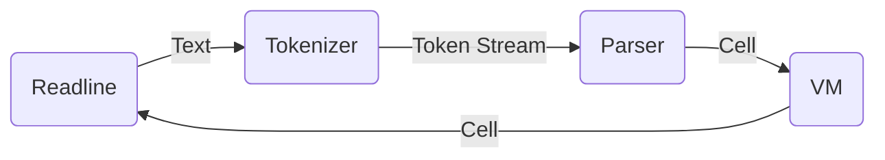

[built-in]: https://github.com/strtok/marwood/tree/master/marwood/src/vm/builtin
[cell]: https://github.com/strtok/marwood/blob/master/marwood/src/cell.rs
[compiler]: https://github.com/strtok/marwood/blob/master/marwood/src/vm/compile.rs
[parser]: https://github.com/strtok/marwood/blob/master/marwood/src/parse.rs
[prelude]: https://github.com/strtok/marwood/blob/master/marwood/prelude.scm
[repl]: https://github.com/strtok/marwood/blob/master/marwood-repl/src/main.rs
[tokenizer]: https://github.com/strtok/marwood/blob/master/marwood/src/lex.rs
[virtual machine]: https://github.com/strtok/marwood/blob/master/marwood/src/vm/mod.rs
[web-repl]: https://github.com/strtok/marwood/tree/master/marwood-wasm
[An Incremental Approach to Compiler Construction]: http://scheme2006.cs.uchicago.edu/11-ghuloum.pdf
[sicp]: https://sicp.sourceacademy.org

# Design Overview

## Highlevel Design Choices

The first major decision when constructing Marwood was to decide how Marwood would evaluate scheme:

1. *Direct evaluation of the AST in the host language*: This is the most natural way to attempt to write an interpreter for Scheme, but it has a few short-comings. Certain features like tail-call optimization and call/cc may be more difficult to implement depending on the host language, and other considerations like memory management are directly affected by the host language. 

    This approach makes a lot of sense if the host language is Scheme, however. There are numerous texts (e.g. [sicp]) on writing meta-circular evaluators in Scheme, and it is one of the many brilliant examples of Scheme's elegant design.
  
2. *Compilation to an existing target architecture*: The target architecture could be hardware based (e.g. x86, amd64, arm) such as in [An Incremental Approach to Compiler Construction], or virtual (JVM, WASM, etc).

3. *Compilation to a custom virtual machine*: A custom virtual machine is created designed to evaluate Scheme.

Marwood uses a custom virtual machine approach.

## Marwood Library

The Marwood library allows the creation of Scheme virtual machines, which may be used to evaluate scheme expressions. Each virtual machine represents the state of a scheme environment (global environment, heap, stack, etc).

Here's an example demonstrating creation of a recursive factorial procedure, and evaluation of `(factorial n)` for n in 0..10:

```rust,noplayground
use marwood::vm::Vm;

fn main() {
    let mut vm = Vm::new();
    let code = r#"
        (define (factorial n)
            (let factorial ([n n] [acc 1])
               (if (zero? n)
                   acc
                   (factorial (- n 1) (* acc n)))))
    "#;

    vm.eval_text(&code).unwrap();

    for it in 0..10 {
        let (cell, _) = vm.eval_text(&format!("(factorial {})", it)).unwrap();
        println!("the factorial of {} is {}", it, cell);
    }
}
```

Which produces the following output:

```
the factorial of 0 is 1
the factorial of 1 is 1
the factorial of 2 is 2
the factorial of 3 is 6
the factorial of 4 is 24
the factorial of 5 is 120
the factorial of 6 is 720
the factorial of 7 is 5040
the factorial of 8 is 40320
the factorial of 9 is 362880
```

## A breakdown of Marwood's Components

The remainder of this text describes the design decisions behind each of Marwood's major library components:

* A [parser] and [tokenizer] used to create Marwood's AST [cell] object. This object acts as both input to the VM's `eval()` function, and also the result of an evaluation. Marwood's tokenizer is also useful in other situations, such as providing input to REPL syntax highlighting and bracket matching.
  
* A [virtual machine] that represents a scheme environment and may be used to execute scheme. The VM may be used to evaluate a `Cell` produced by Marwood's parser. Successful evaluation results in an output `Cell`, that represents the result of the evaluation. 

* A [compiler] that given a `Cell` and a `VM`, constructs compiled bytecode to be executed on the VM.

* Numerous [built-in] Scheme library procedures written in rust, and a scheme [prelude] containing library procedures written in scheme.

* The [repl] and [web-repl] crates. These creates are separate from the main Marwood library crates, and provide example implementations of REPLs that use the Marwood library.

This diagram illustrates a Marwood read-eval-print loop. Text is read from the readline library, tokenized, parsed, evaluated and then the resulting `Cell` object is printed back to the user.

The VM object maintains any state expected by the user between evaluations. For example, if the user enters `(define x 10)`, then on evaluation the VM object will modify its heap to represent the new binding for x.



The remaining sections of this text describe in detail how these different components were designed.