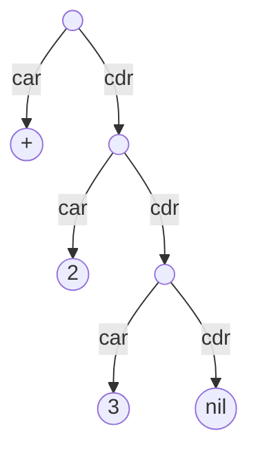

[sexpr]: https://en.wikipedia.org/wiki/S-expression

# S-Expressions

When designing a scheme parser, we first have to think a little bit about how to represent Scheme expressions in Rust's type system.

Fortunately, Lisp set a precedent by designing the language so that data and code are interchangible and can be represented by a data structure called an S-expression or [sexpr].

A sexpr can be thought of as an aggregate type that can represent one of two things:

1. an atom, such as a booleans, numbers, symbols, strings, nil, etc.
2. a pair in the form (*car* . *cdr*), where *car *and *cdr* are themselves S-expressions

The expression `(+ 2 3)` in scheme is sugar for a tree of pairs, which could be rewritten  `(+ . (2 . (3 . ())))`.

This diagram depicts the above expression as a tree:

