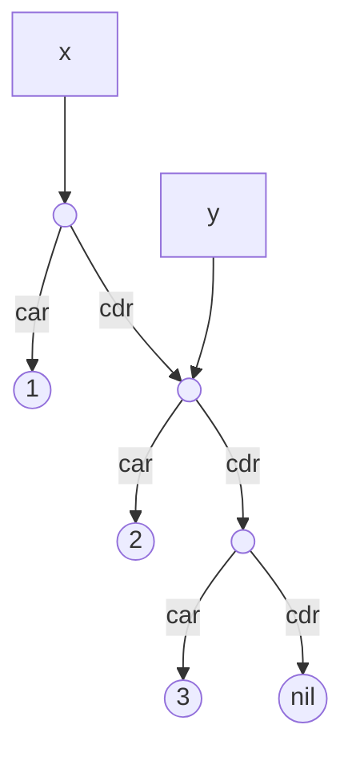
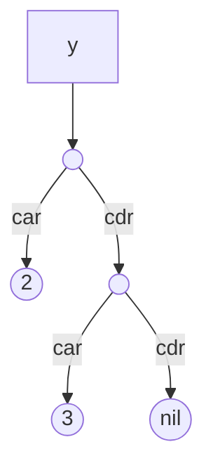

# Why a second Cell type?

While Marwood's `Cell` type is able to represent any scheme expression, it's not suitable for representing Scheme structure in Marwood's VM.

Consider the following expressions that create a small list bound to x, and then bind y to a subset of the list:

```scheme
(define x '(1 2 3))
(define y (cdr x))
```

This is because the expression `(define y (cdr x))` has bound y to a sub-structure of x. It is not a copy. If y were mutated with `set-car!` or `set-cdr!` we would expect the structure that x is bound to realize the mutation also.



Further, if x were to be bound to another value, we expect that Marwood be able to garbage collect any part of the structure no longer referenced. In this example, the pair x is pointing to would no longer be required and may be collected. Only the structure referenced by y would remain:

```
(define x 0)
```



Representing this relationship with Marwood's existing `Cell` data structure would be very difficult. With the `Cell` data structure, pairs are represented as `Pair(Box<Cell>, Box<Cell>)`. It's not possible for two pairs to refer to the same data structure.

# VCell

The `VCell` type is how Marwood represents scheme at runtime. It's also used to represent other runtime objects, such as VM op codes, registers, and even lexical environments. Marwood's stack and heaps are just vectors of VCell. It is the universal type!

Instead of a pair being represented by `(Box<Cell>, Box<Cell>)`, a VCell pair is represented by `(usize, usize)`, each usize corresponding to the locations of the `car` and `cdr` portions on the heap. This is explored further in the section on Marwood's heap.

```rust,noplayground
#[derive(Clone, Debug, Eq, PartialEq)]
pub enum VCell {
    Bool(bool),
    Char(char),
    Nil,
    Number(Number),
    Pair(usize, usize),
    Symbol(Rc<String>),
    String(Rc<RefCell<String>>),
    Vector(Rc<Vector>),
    ...
}
```

>**Note:** Marwood's VCell enum is kept a maximum of 24 bytes. 8 bytes represent the enum tag, and an additional 16 bytes  remain for data. Any VCell variants that may exceed this size are boxed with `Rc`, though the most common types fit well within this limit.
> Keeping VCell as small as possible has the benefit that it may be trivially cloneable, which comes in handy when encountering any borrow checker related issues with reading VCell values from Marwood's heap and stack.


# VCell > Scheme

VCell's primary role is to represent scheme data in Marwood's VM, but it's also used to represent Marwood's internal instruction format (byte code) and values on Marwood's stack, heap, global and lexical environments. The remaining VCell variants are used to represent the various types that may be encountered.

```rust,noplayground
#[derive(Clone, Debug, Eq, PartialEq)]
pub enum VCell {
    ...

    Continuation(Rc<Continuation>),
    Closure(usize, usize),
    Lambda(Rc<Lambda>),
    LexicalEnv(Rc<LexicalEnvironment>),
    LexicalEnvSlot(usize),
    LexicalEnvPtr(usize, usize),
    Macro(Rc<Transform>),

    Acc,
    ArgumentCount(usize),
    BasePointer(usize),
    BasePointerOffset(i64),
    BuiltInProc(Rc<BuiltInProc>),
    EnvironmentPointer(usize),
    GlobalEnvSlot(usize),
    InstructionPointer(usize, usize),
    OpCode(OpCode),
    Ptr(usize),
}
```