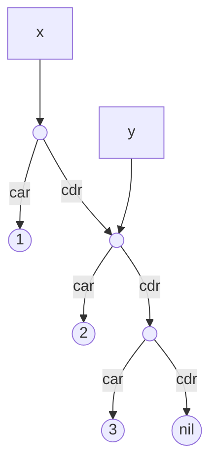
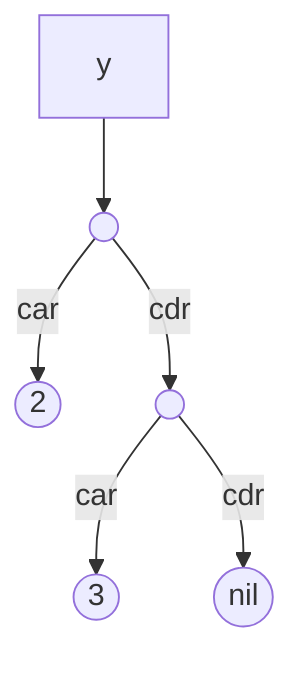

# Why a second Cell type?

While Marwood's `Cell` type is able to represent any scheme expression, it's not suitable for representing Scheme structure in Marwood's VM.

Consider the following expressions that create a small list bound to x, and then bind y to a subset of the list:

```scheme
(define x '(1 2 3))
(define y (cdr x))
```

This is because the expression `(define y (cdr x))` has bound y to a sub-structure of x. It is not a copy. If y were mutated with `set-car!` or `set-cdr!` we would expect the structure that x is bound to realize the mutation also.



Further, if x were to be bound to another value, we expect that Marwood be able to garbage collect any part of the structure no longer referenced. In this example, the pair x is pointing to would no longer be required and may be collected. Only the structure referenced by y would remain:

```
(define x 0)
```



Representing this relationship with Marwood's existing `Cell` data structure would be very difficult. With the `Cell` data structure, pairs are represented as `Pair(Box<Cell>, Box<Cell>)`. It's not possible for two pairs to refer to the same data structure.

# VCell

The `VCell` type is how Marwood represents scheme at runtime. It's also used to represent other runtime objects, such as op codes, registers, and even lexical environments. Anything on Marwood's stack or heap is a VCell.

